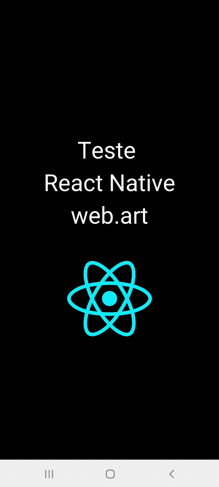

<h1 align="center" class="line-1 anim-typewriter">Desafio React Native Web.art </h1>


<h2>Preview (vídeo sem áudio)</h2>



<br>


<h2 id="the_challenge"> 🌋 O teste</h2>

Esta é a solução do teste proposto pela [Web.art](https://www.webart.com.br/).

Requisitos obrigatórios:
  - [x] O app deve possuir um campo para cadastro de novos itens na lista;
  - [x] O app deve contabilizar alterar os estilos do item da lista caso este item esteja selecionado;
  - [x] O app deve permitir a exclusão de itens da lista, sendo que é necessário confirmar com o usuário se o item pode realmente ser excluído;
  - [x] O app deve apresentar a mensagem de “nenhum item na lista” caso nenhum item tenha sido adicionado.
 
Requisitos opcionais:
  - [x] Splash screen; 
  - [x] Confirmar com o usuário se deseja realmente fechar o app;
  - [x] Executar um som ao selecionar/remover seleção de um item da lista;
  - [ ] Persistir os itens da lista para que o usuário possa fechar o app sem perder os dados;
  - [ ] Permitir edição do nome do item da lista;
  
<h2 id="built_with">👷‍♂️ Ferramentas utilizadas</h2>

-   React Native e React;
-   Expo e Expo-av (biblioteca de áudio);


<h2 id="built_with">📝 Como rodar o projeto localmente?</h2>

```bash

  git clone https://github.com/kenan455/teste-react-native-web.art.git

  cd teste-react-native-web.art

  npm install # ou yarn install 

  npm run start # ou yarn start 
```

<h2 id="author">👨‍🎓 Autor </h2>

- Nome: Kenan Fintelman
- E-mail: kenanfintelman123@hotmail.com
